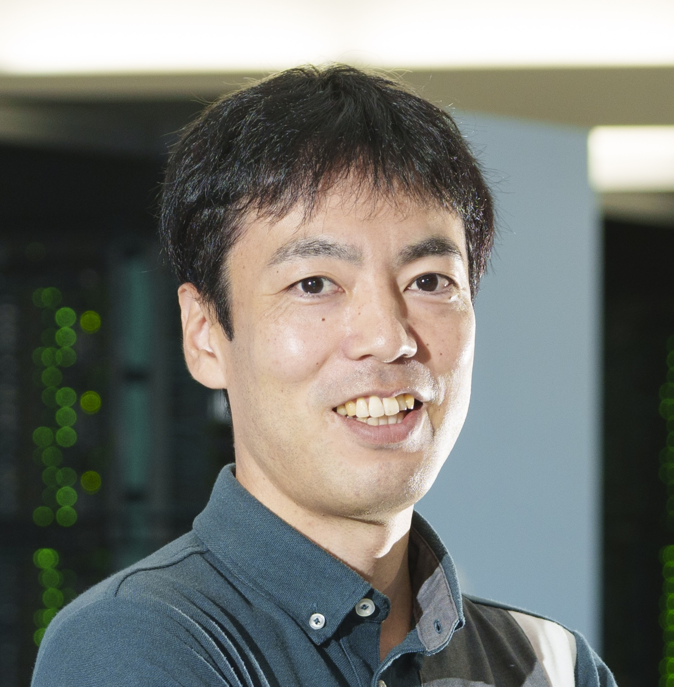

My name is Yohsuke Murase.
I study how cooperation and collective behavior emerge in complex social systems, from evolutionary game dynamics to networked interactions. My work combines theoretical modeling with large-scale simulation to understand how local rules shape global outcomes.

    <a href="mailto:yohsuke.murase@riken.jp"><i style="font-size:24px" class="fa fa-envelope"></i></a>
    <a href="https://github.com/yohm/"><i style="font-size:24px" class="fa fa-github"></i></a>
    <a href="https://yohm.github.io/"><i style="font-size:24px" class="fa fa-home"></i></a>

