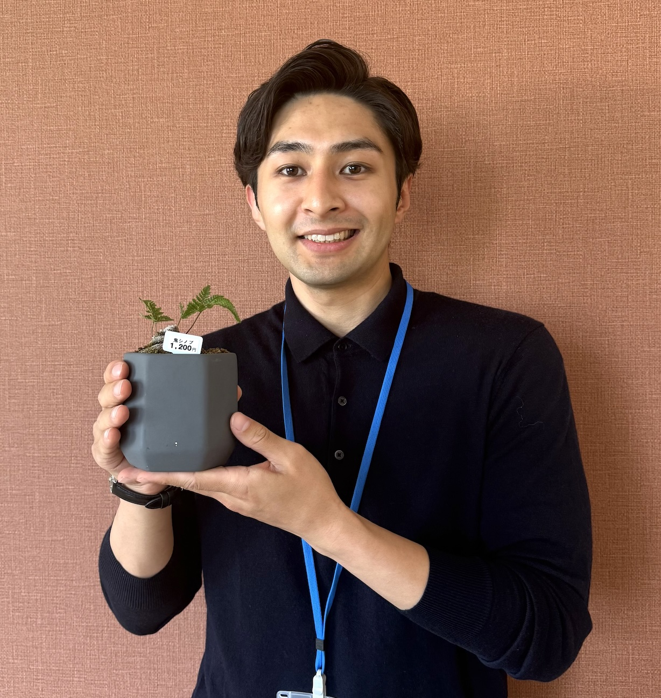

My name is Shinobu Utsumi. I am a JSPS PD Researcher in the Mathematical Social Science Team at the RIKEN Center for Interdisciplinary Theoretical and Mathematical Sciences (iTHEMS).

My research is motivated by a fascination with the universal laws hidden behind social and natural phenomena. So far, my work spans multiple interdisciplinary themes:

How are people connected within social systems?
Why do cooperation and defection emerge?
How do infectious diseases spread through human populations?

Recently, I have also been working on tree structure analysis to reveal the underlying topological principles and geometric beauty of bonsai.
Beyond bonsai, art and aesthetics exist in every society across every era — yet they have not been fully explored in sociophysics, sociology, and related fields. I hope to help bridge that gap within this team.

    <a href="mailto:shinobu.utsumi@riken.jp"><i style="font-size:24px" class="fa fa-envelope"></i></a>
    <a href="https://sites.google.com/view/utsumishinobu"><i style="font-size:24px" class="fa fa-home"></i></a>

